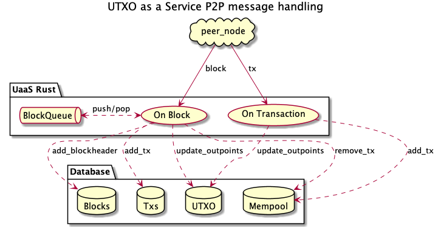

# UTXO as a Service - Rust Implementation

 The UTXO as a Service (UaaS) monitors BSV Node Peer to Peer (P2P) messages and builds its own UTXO set that can be queried to obtain non-standard transactions.

This uses service implemented in Rust with a Python REST API web interface.
The two components read the same configuration file and share data using database and a shared data directory.


The service stores blocks and can return transactions from those blocks.
If you need transactions that are in the mempool you will need to set up a `Collection` which
will capture all transactions that match a particular pattern.
For more details on setting up a `Collection` see the configuration documentation [here](docs/Configuration.md).

This project uses the following Bitcoin SV Rust library for processing peer to peer (P2P) messages:
https://github.com/brentongunning/rust-sv


## To Build the Project
The project is developed in Rust.
The best way to install Rust is to use `rustup`, see https://www.rust-lang.org/tools/install

To build:
```bash
cd rust
cargo build
```
Note that this projec


To run:
```bash
cd rust
cargo run
```

## Database
This service writes the P2P messages to a `MySQL` database.
Database setup details can be found [here](docs/Database.md).

## Docker
Encapsulating the service in Docker removes the need to install the project dependencies on the host machine.
Only Docker is required to build and run the service.
### 1) Build The Docker Image
To build the docker image associated with the service run the following comand in the project directory.
```bash
cd python
./build.sh
```
This builds the docker image `uaas-web`.
### 2) To Run the Image
Once the `uaas-web` image has been build, to run the service use the following script:
```bash
cd python
./run.sh
Running in Docker
INFO:     Started server process [14]
INFO:     Waiting for application startup.
INFO:     Application startup complete.
INFO:     Uvicorn running on http://0.0.0.0:5010 (Press CTRL+C to quit)
```
## Web Interface
The service provides a REST API with a Swagger interface at http://localhost:5010/docs


The service needs to be started with the `-web` command line parameter
The service with webserver application can be started in the Docker container as follows:

## Configuration
The configuration of the service is set in `data/uaasr.toml` file.
This is read when the service starts up.

For more details about the configuration file see [here](docs/Configuration.md).


## Directories
The following directories exist in this project:
```
├── data
├── docs
│   └── diagrams
├── rust
│   └── src
└── python
    └── src

```
These directories contain the following:
* `data` - Configuration, data and logs used and created by the service
* `docs` - Project documentation
* `docs/diagrams` - PlantUML diagrams and source in support of the documentation
* `rust/src` - Service source code in Rust
* `python/src` - Python REST web interface to UaaS


## Development
The following diagram shows how the Rust UaaS processes individual `transactions` and `blocks` from peer nodes.


The point to note that as `transactions` (or `tx`) are received they are placed in the `mempool` table in the database.

When `blocks` are received:
1) the `tx` are removed from the `mempool` and added to the `txs` table
2) The `tx` input `outpoints` are removed from the `UTXO` table
3) The `tx` output `outpoint` are added to the `UTXO` table
4) The Block's `blockheader` is added to the `Blocks` table

Another point to note is that this means that blocks and transaction can be processed prior to the block tip being obtained.

The only constraint is that the blocks must be processed in order. This is achieved by ensuring that the `prev_hash` field of the block matches the `hash` of the last block processed, all other blocks are placed on a queue for later processing.

Project development details can be found [here](docs/Development.md).

Project status notes can be found [here](docs/Project.md).
