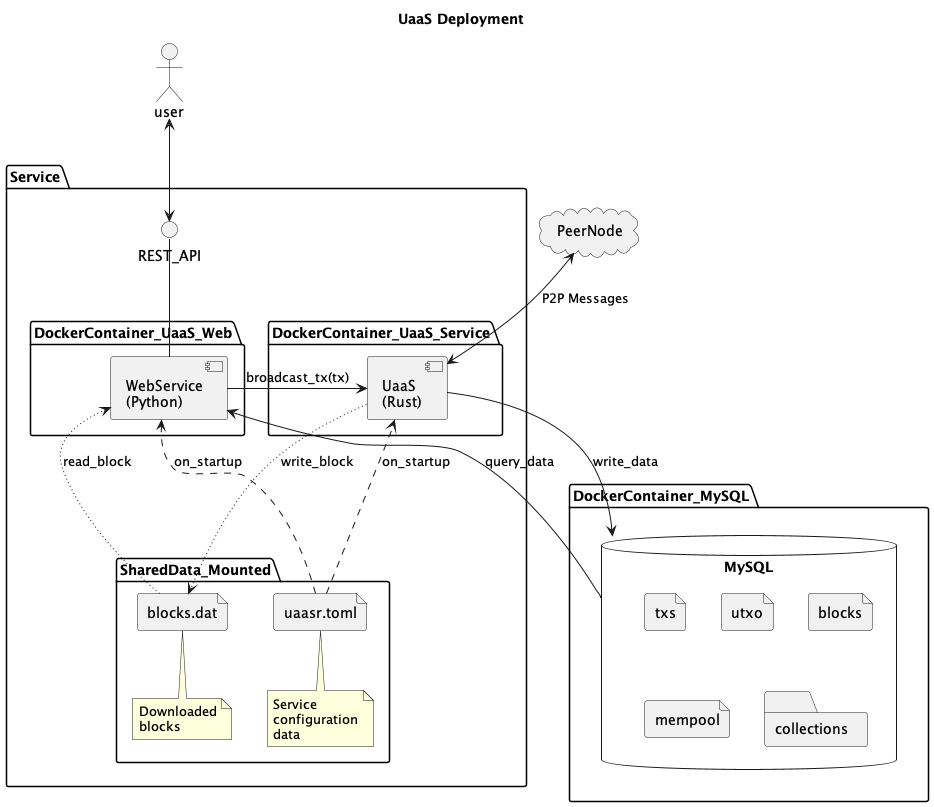

# UTXO as a Service - Rust Implementation

 The UTXO as a Service (UaaS) monitors BSV Node Peer to Peer (P2P) messages and builds its own UTXO set that can be queried to obtain non-standard transactions.

This uses service implemented in Rust with a Python REST API web interface.
The two components read the same configuration file and share data using `MySQL` database and a shared data directory.
The diagram also shows the Docker containers that make up the service.


The service stores blocks and can return transactions from those blocks.

If you need transactions that are not in blocks but are in the mempool you will need to set up a `Collection` which
will capture all transactions that match a particular pattern.
For more details on setting up a `Collection` see the configuration documentation [here](docs/Configuration.md).

This project uses the following Chain-Gang Rust library for processing peer to peer (P2P) messages:
https://github.com/nchain-innovation/chain-gang


## Run UaaS in Docker Compose
The docker compose starts the componets that make up the UaaS system in one command.
First build the images using the `build.sh` command.
```bash
$ ./build.sh
```
Then start the system 
```bash
$ docker-compose up -d
```
To stop the system 
```bash
$ docker-compose down
```


## To Build the Service
The service is developed in Rust.
The best way to install Rust is to use `rustup`, see https://www.rust-lang.org/tools/install

To build:
```bash
cd rust
cargo build
```

## To Run the Service
Note that this project requires the `MySQL` database running to run.
See the `Database` section below for details.

To run:
```bash
cd rust
cargo run
```

If the following message is seen in the output, this would mean that the service is unable to conect to the `MySQL` database.
```
thread 'main' panicked at 'Problem connecting to database. Check database is connected and configuration is correct.
: DriverError { Could not connect to address `localhost:3306': Cannot assign requested address (os error 99) }', src/uaas/logic.rs:52:14
```
## To Run the REST Web interface

The REST Web interface has been developed in Python.

To run this
```bash
cd python\src
./web.py
```
Note again that this is dependent on `MySQL` database.

This will provide a REST API with a Swagger interface at http://localhost:5010/docs


## Database
This service records data to a `MySQL` database which must be present for the service to run.
Database setup details can be found [here](docs/Database.md).

## Docker
Encapsulating the service in Docker removes the need to install the project dependencies on the host machine.
Only Docker is required to build and run the service and web interface.
Note that the `MySQL` docker image is still required.
### 1) Build The Docker Image
To build the docker image associated with the service run the following comand in the project directory.
```bash
./build.sh
```
This builds two Docker images:
* `uaas-service` for the Rust service
* `uaas-web` for the Python REST API
If there is an out of diskspace error whilst building the images, use the following comand to free up diskspace:
```bash
docker system prune
```
### 2) To Run the Image
As there are two Docker images there are also two startup scripts:
* `run_service.sh` - to start the Rust service
* `run_web.sh` - to start the Python REST API

## Configuration
The configuration of the service is set in `data/uaasr.toml` file.
This is read when the service starts up.

For more details about the configuration file see [here](docs/Configuration.md).


## Directories
The following directories exist in this project:
```
├── data
├── docs
│   └── diagrams
├── python
│   └── src
├── rust
│   └── src
└── rust-sv
```
These directories contain the following:
* `data` - Configuration, data and logs used and created by the service
* `docs` - Project documentation
* `docs/diagrams` - PlantUML diagrams and source in support of the documentation
* `python/src` - Python REST web interface to UaaS
* `rust/src` - Service source code in Rust

## Development
The following diagram shows how the Rust UaaS processes individual `transactions` and `blocks` from peer nodes.


The point to note that as `transactions` (or `tx`) are received they are:
1) the `tx` added to the `mempool` database table
2) the `tx` input `outpoints` are removed from the `UTXO` table
3) the `tx` output `outpoints` are added to the `UTXO` table

When `blocks` are received:
1) the `tx` are removed from the `mempool` and added to the `txs` table
2) the `tx` input `outpoints` (if present) are removed  from the `UTXO` table
3) the `tx` output `outpoints` are added/updated to the `UTXO` table
4) the Block's `blockheader` is added to the `Blocks` table

Another point to note is that this means that blocks and transaction can be processed prior to the block tip being obtained.

The only constraint is that the blocks must be processed in order. This is achieved by ensuring that the `prev_hash` field of the block matches the `hash` of the last block processed, all other blocks are placed on a queue for later processing.

Project development details can be found [here](docs/Development.md).

Project status notes can be found [here](docs/Project.md).
