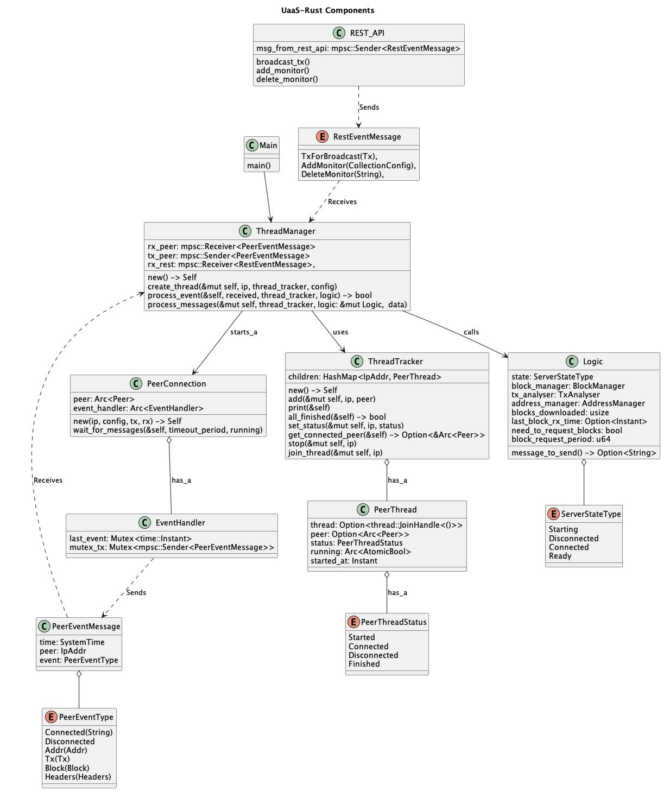

# Rust Development
As noted in the main README.md  the best way to install Rust is to use `rustup`.
This code was developed using rustc `1.60.0`.

Once installed update rust toolset using:
```bash
rustup update
```

To run unit tests:
```bash
cd rust
cargo test
```

To format the code:
```bash
cd rust
cargo fmt
```

For Rust hints:
```bash
cd rust
cargo clippy
```

# Python Development
To lint the source code use the following command line script from the project root directory:
```
$ ./lint.sh
```
This requires `flake8` and `mypy` to be installed to perform the static code analysis.

# Background Links
Details of the messages and the Bitcoin SV peer to peer protocol can be found in the following links:

* https://wiki.bitcoinsv.io/index.php/Peer-To-Peer_Protocol
* https://developer.bitcoin.org/reference/p2p_networking.html


Note as of Bitcoin SV 1.0.11 bloom filters are no longer supported.

# Service Datastructures
The Rust component of the service is constructed of the following components.




# Peer Thread Status States
The peer thread works through the following states:


# Notes
This service processes blocks before reaching the ready state.
However it only processes blocks in the correct order. If blocks arrive out of order they are queued for later processing.


This service writes the blocks to the disk in the correct order and asserts if reading them out of order.

Tx are placed in the mempool prior to the service reaching the ready state.

The ready state means that the service has caught up with the chain tip.

This service only keeps block headers in memory - it writes blocks out to the hard disk.


Note that if the service is off line for a period the mempool may not be correct.
That is to say that it may have missed transaction announcements


